# **RETO ENTORNOS DE DESARROLLO**

## Descripción del proyecto
Demostrar conocimientos de GitHub y GitGub desktop. Realización de tareas como
creación y actualización de repositorios, Pull Requests, Push Origins, Commits,
creación de ramas, la fusión de las mismas, etc.
#### 1.Creación de un repositorio público.
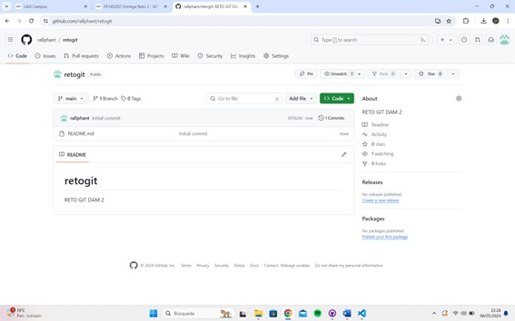

#### 2.Importación de un proyecto JAVA.
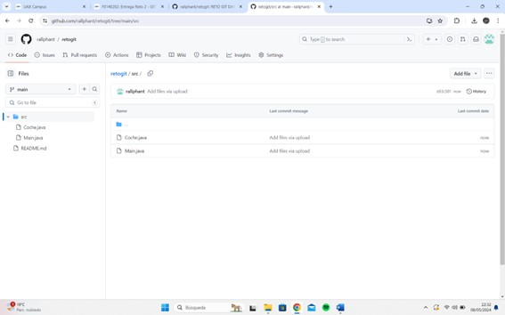
#### 3.Creación de una nueva rama de desarrollo: "desarrolloPersona".
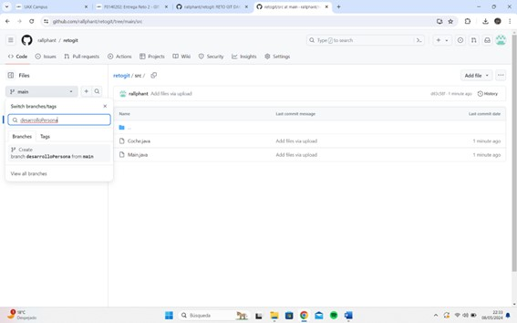
#### 4.Clonación del repositorio en GitHub desk y descarga en el repositorio local.
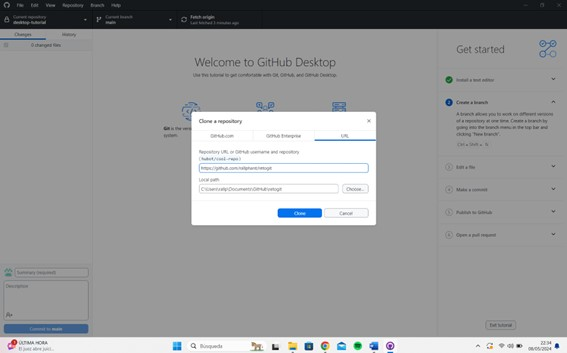
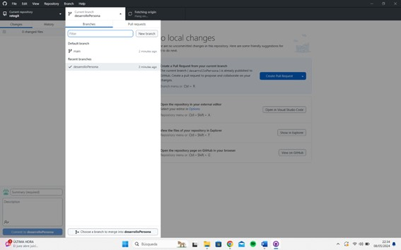

#### 5.Creación de una nueva clase en el proyecto. Documentación de la actualización.
#### Commit y Push Origin para actualizar el repositiorio remoto.
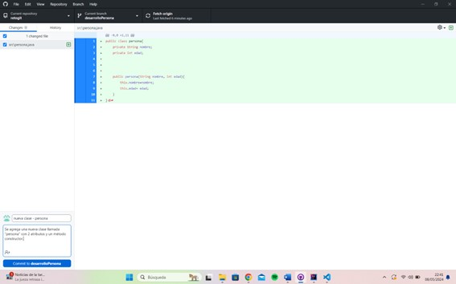
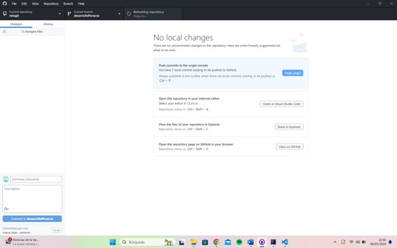
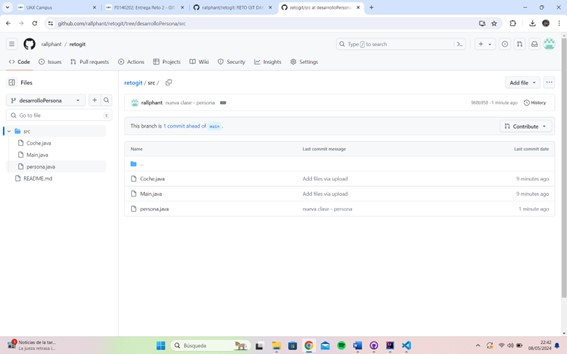

#### 6.Modificación de una clase del proyecto. Documentación de la actualización.
#### Commit y Push Origin para actualizar el repositiorio remoto.
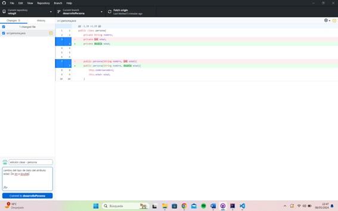
#### 7.Comprobación de los cambios
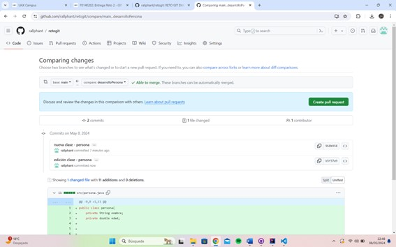

#### 8.-Fusión de la rama "desarrolloPersona" con la rama "main" 
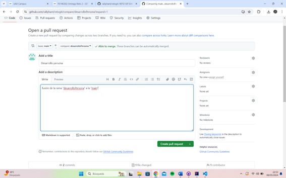
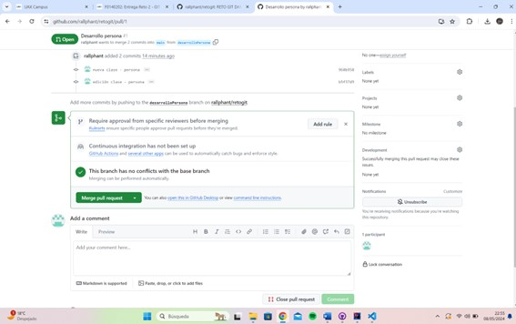
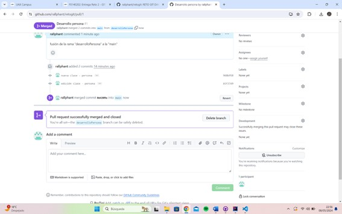

